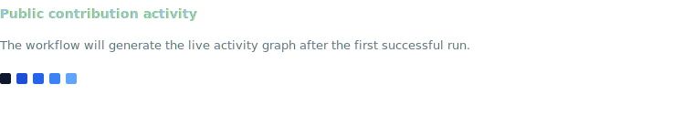

  
  
  

  
<strong>Cybersecurity Governance &amp; GRC Consultant</strong>

  
Helping organizations align security, risk, and compliance with business objectives.

## About Me

- IT Manager
- Privacy Professional
- Auditor
- I work on cybersecurity governance and GRC topics
- I am interested in risk, compliance, and security operations
- I use technology to support practical, structured problem solving

---

## Articles

- Read more of my articles on [Privacy Evolution](https://privacyevolution.substack.com/)

---

## Certifications

  
  
  
  
  

- CIPP/E (Certified Information Privacy Professional/Europe) — International Association of Privacy Professionals (IAPP)
- CIPM (Certified Information Privacy Manager) — International Association of Privacy Professionals (IAPP)
- Europrivacy Auditor
- Google Cybersecurity Professional Certificate — Google
- Google IT Support Professional Certificate — Google

---

## Technology Stack

  

  
  

- Linux
- Python
- Docker
- Grafana
- Google Cloud
- DigitalOcean
- Agentic AI tools and workflows, including Codex and Claude
- Synology

---

## Featured Projects

- [Governance-Risk-Compliance-Toolbox](https://github.com/ghostlucius/Governance-Risk-Compliance-Toolbox)  
  Curated repository of privacy, governance, data protection, and cybersecurity references for practical research and program support.

- [cf7-international-phone-prefix](https://github.com/ghostlucius/cf7-international-phone-prefix)  
  WordPress plugin that adds international phone selection and normalizes submitted numbers to E.164 for downstream CRM and automation workflows.

- [VideoFixer](https://github.com/ghostlucius/VideoFixer)  
  Lightweight Windows utility built to simplify video repair workflows through an accessible interface around `ffmpeg`.

---

## Statistics

<!-- START:statistics -->
- Public repositories: 5
- Followers: 2
- Following: 9
- Account created: October 2021
- Top public repository languages by repository count: JavaScript (2), PHP (1), Python (1)

<!-- END:statistics -->

---

## Recent Activity

<!-- START:recent-activity -->
- Jul 14, 2026: Starred [Dicklesworthstone/destructive_command_guard](https://github.com/Dicklesworthstone/destructive_command_guard).
- Jul 6, 2026: Starred [Diolinux/PhotoGIMP](https://github.com/Diolinux/PhotoGIMP).
- Jul 6, 2026: Starred [atlantsecurity/atlant-harden](https://github.com/atlantsecurity/atlant-harden).
- Jul 1, 2026: Starred [frappe/lms](https://github.com/frappe/lms).
- Jun 30, 2026: Published release [v1.2.4](https://github.com/ghostlucius/VideoFixer/releases/tag/v1.2.4) for [ghostlucius/VideoFixer](https://github.com/ghostlucius/VideoFixer).
<!-- END:recent-activity -->

---

## Latest Repositories

<!-- START:latest-repos -->
- [rock_paper_scissor](https://github.com/ghostlucius/rock_paper_scissor) · JavaScript — No description yet.
<!-- END:latest-repos -->
